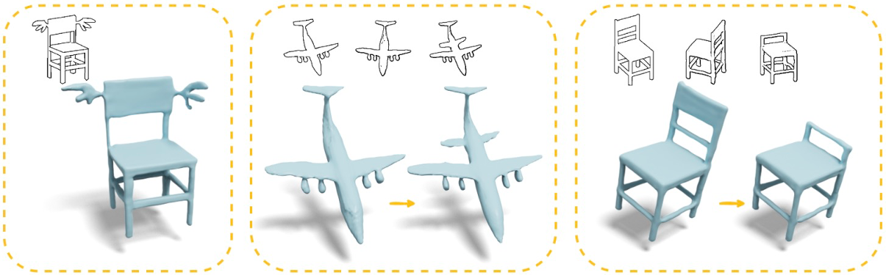
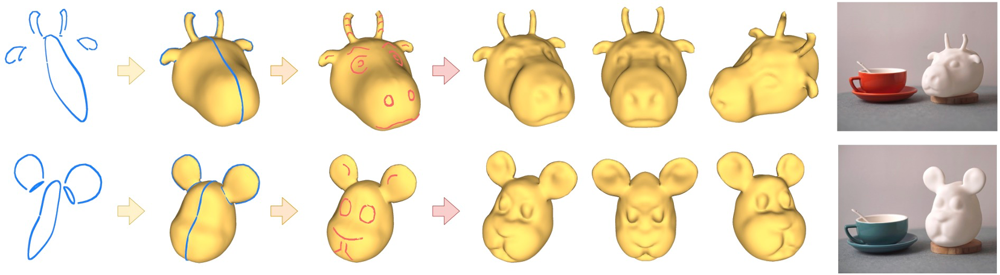
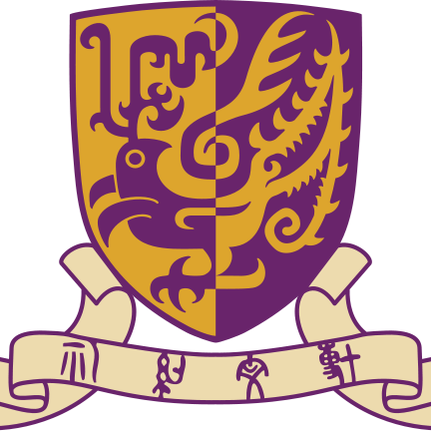

I am currently a Ph.D. student in Creative Media at City University of Hong Kong, under the supervision of <a href="https://hongbofu.people.ust.hk/">Prof. Hongbo Fu</a> and <a href="https://scholars.cityu.edu.hk/en/persons/miu-ling-lam(5eb6d755-d3d1-4d6c-9899-5a50de19a4e5).html">Prof. Miu-Ling Lam</a>. 
Prior to this, I received my Master's degree in Computer Technology from Shanghai Jiao Tong University, under the guidance of <a href="https://dmcv.sjtu.edu.cn/people/">Prof. Lizhuang Ma</a>.
My research interests lie in Computer Graphics and 3D Computer Vision, with a primary focus on sketch-based 3D modeling and character animation. 
I am also collaborating closely with <a href="https://gaplab.cuhk.edu.cn/pages/people">Prof. Xiaoguang Han</a>.

<!-- ############## -->
<!-- interests -->
<!-- ############## -->

Interests
------
* Sketch-based 3D Modeling
* 3D Character Animation
* controllable AIGC

<!-- ############## -->
<!-- news -->
<!-- ############## -->

<!-- News -->
<!-- ------ -->
<!-- * [2024.07] One paper got accepted by ACM SIGGRAPH Asia Conference 2024. -->

<!-- ############## -->
<!-- publications -->
<!-- ############## -->

Selected Publications
------

  

  

  

    
      <b><i>DrawingSpinUp</i>: 3D Animation from Single Character Drawings</b>
       
     
    
      <b>Jie Zhou</b>, 
      Chufeng Xiao,
      Miu-Ling Lam, 
      Hongbo Fu
       
     
    
      ACM SIGGRAPH Asia Conference, 2024
       
     
    
      <a href="https://arxiv.org/abs/2409.08615">[arXiv]</a> /
      <a href="https://lordliang.github.io/DrawingSpinUp/">[project]</a> /
      <a href="https://github.com/LordLiang/DrawingSpinUp">[code]</a>
    
  

 

  

  

  

    
      <b><i>GA-Sketching</i>: Shape Modeling from Multi-View Sketching with Geometry-Aligned Deep Implicit Functions</b>
       
     
    
      <b>Jie Zhou</b>, 
      Zhongjin Luo, 
      Qian Yu, 
      Xiaoguang Han, 
      Hongbo Fu
       
     
    
      Pacific Graphics/Computer Graphics Forum (PG/CGF), 2023 
       
     
    
      <a href="https://onlinelibrary.wiley.com/doi/10.1111/cgf.14948">[paper]</a> / 
      <a href="https://arxiv.org/abs/2309.05946">[arXiv]</a> /
      <a href="https://github.com/LordLiang/GA-Sketching">[code]</a>
    
  

 

  

  

  

    
      <b><i>SimpModeling</i>: Sketching Implicit Field to Guide Mesh Modeling for 3D Animalmorphic Head Design</b>
       
     
    
      Zhongjin Luo, 
      <b>Jie Zhou</b>, 
      Heming Zhu, 
      Dong Du, 
      Xiaoguang Han,
      Hongbo Fu
       
     
    
      ACM Symposium on User Interface Software and Technology (UIST), 2021
       
     
    
      <a href="https://dl.acm.org/doi/abs/10.1145/3472749.3474791">[paper]</a> /
      <a href="https://arxiv.org/abs/2108.02548">[arXiv]</a> / 
      <a href="https://zhongjinluo.github.io/SimpModeling/">[project]</a> /
      <a href="https://github.com/zhongjinluo/SimpModeling/">[code]</a>
    
  

<!-- ############## -->
<!-- education -->
<!-- ############## -->

Education
------

  <b>City University of Hong Kong</b>  
  Nov. 2020 - Present  
  Ph.D. student in Creative Media at <a href="https://hongbofu.people.ust.hk/">Hongbo's Group</a>. 

  

  <b>Shanghai Jiao Tong University</b>  
  Sep. 2017 – Mar. 2020  
  Master's Degree in Computer Technology at <a href="https://dmcv.sjtu.edu.cn/">DMCV Lab</a>. 

  

  <b>Southeast University</b>  
  Sep. 2013 – Jun. 2017  
  Bachelor's Degree in Computer Science and Engineering.  

  

Professional Experience
------

  <b>The City University of Hong Kong</b>  
  Nov. 2024 – Present  
  Research Assistant at School of Creative Media.  

  

  <b>The Chinese University of Hong Kong, Shenzhen</b>  
  May. 2022 – Sep. 2022  
  Visiting Ph.D. Student at <a href="https://gaplab.cuhk.edu.cn/">GAP Lab</a>. 

  

  Tencent Inc. Shanghai  
  Jul. 2019 – Mar. 2020  
  Research Intern. at Tencent YouTu Lab.  

  

Service
------
* I serve as a paper reviewer for CGI 2025.
* I serve as a paper reviewer for SIGGRAPH 2025.

<!-- ############## -->
<!-- visit map -->
<!-- ############## -->

<!--  -->
