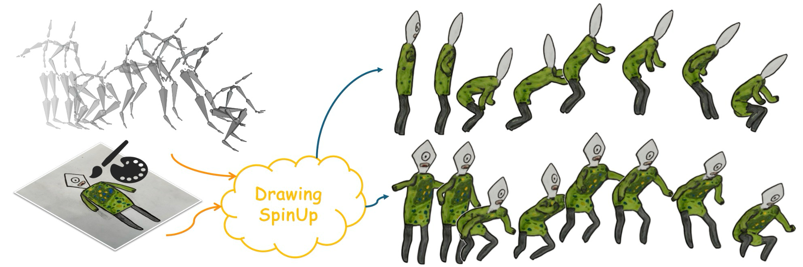

I am currently a Ph.D. student in Creative Media at the City University of Hong Kong, under the supervision of <a href="https://hongbofu.people.ust.hk/">Prof. Hongbo Fu</a> and <a href="https://scholars.cityu.edu.hk/en/persons/miu-ling-lam(5eb6d755-d3d1-4d6c-9899-5a50de19a4e5).html">Prof. Miu-Ling Lam</a>. 
Prior to this, I received my Master's degree in Computer Technology from Shanghai Jiao Tong University, under the guidance of <a href="https://dmcv.sjtu.edu.cn/people/">Prof. Lizhuang Ma</a>.
My research interests lie in Computer Graphics and 3D Computer Vision, with a primary focus on sketch-based 3D modeling and character animation. 
I am also collaborating closely with <a href="https://gaplab.cuhk.edu.cn/pages/people">Prof. Xiaoguang Han</a> at the School of Science and Engineering of the Chinese University of Hong Kong (Shenzhen).

<!-- ############## -->
<!-- interests -->
<!-- ############## -->

Interests
------
* Sketch-based 3D Modeling
* Character Animation

<!-- ############## -->
<!-- news -->
<!-- ############## -->

News
------
* [2024.07] One paper got accepted by SIGGRAPH Asia 2024.

<!-- ############## -->
<!-- publications -->
<!-- ############## -->

Publications
------

  

  

  

    
      <b><i>DrawingSpinUp</i>: 3D Animation from Single Character Drawings</b>
       
     
    
      <b>Jie Zhou</b>, 
      Miu-Ling Lam, 
      Hongbo Fu
       
     
    
      <b>SIGGRAPH Asia</b>, 2024
       
     
    
      <a href="https://arxiv.org/abs/2409.08615">[arXiv]</a> /
      <a href="https://lordliang.github.io/DrawingSpinUp/">[project]</a> /
      <a href="https://github.com/LordLiang/DrawingSpinUp">[code]</a>
    
  

 

  

  

  

    
      <b><i>GA-Sketching</i>: Shape Modeling from Multi-View Sketching with Geometry-Aligned Deep Implicit Functions</b>
       
     
    
      <b>Jie Zhou</b>, 
      Zhongjin Luo, 
      Qian Yu, 
      Xiaoguang Han, 
      Hongbo Fu
       
     
    
      Computer Graphics Forum (<b>CGF</b>), 2023 
       
     
    
      <a href="https://onlinelibrary.wiley.com/doi/10.1111/cgf.14948">[paper]</a> / 
      <a href="https://arxiv.org/abs/2309.05946">[arXiv]</a> /
      <a href="https://github.com/LordLiang/GA-Sketching">[code]</a>
    
  

 

  

  

  

    
      <b><i>SimpModeling</i>: Sketching Implicit Field to Guide Mesh Modeling for 3D Animalmorphic Head Design</b>
       
     
    
      Zhongjin Luo, 
      <b>Jie Zhou</b>, 
      Heming Zhu, 
      Dong Du, 
      Xiaoguang Han,
      Hongbo Fu
       
     
    
      ACM Symposium on User Interface Software and Technology (<b>UIST</b>), 2021
       
     
    
      <a href="https://arxiv.org/abs/2108.02548">[paper]</a> / 
      <a href="https://zhongjinluo.github.io/SimpModeling/">[project]</a> /
      <a href="https://github.com/zhongjinluo/SimpModeling/">[code]</a>
    
  

<!-- ############## -->
<!-- education -->
<!-- ############## -->

<!-- Education Experience -->
<!-- ------ -->
<!--  -->
<!-- 

  <b>Tsinghua University, Beijing, China</b>  
  September 2022 -    
  Ph.D. in Software Engineering at <a href="https://www.thss.tsinghua.edu.cn/en/">School of Software</a> 

  

  <b>Beijing Institute of Technology, Beijing, China</b>  
  September 2018 - June 2022  
  B.E. in Computer Science at <a href="https://xuteli.bit.edu.cn/">Xu Class</a> 
   <b>GPA 90.0, rank 2/56</b>  

  

 -->

<!-- ############## -->
<!-- visit map -->
<!-- ############## -->

<!--  -->
